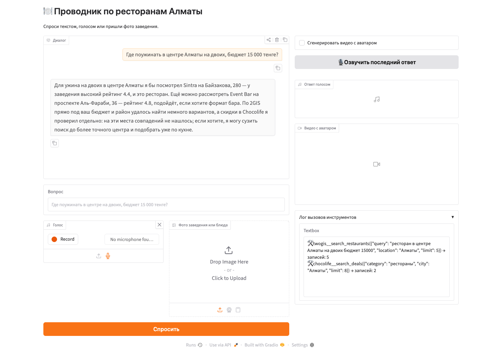
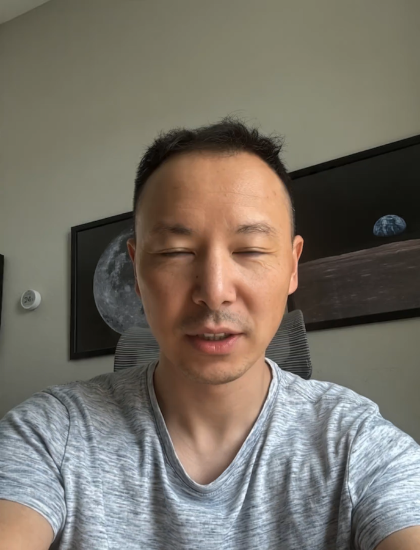

# 🍽️ AI Avatar Agent — проводник по ресторанам Алматы

Мультимодальный агент: принимает вопрос текстом, голосом или фотографией, сам
решает, какие инструменты вызвать, ищет заведения и акции через два
собственных MCP-сервера и отвечает текстом, а по запросу — голосом владельца
проекта и видео с говорящим аватаром.

## Архитектура

    вход: текст | аудио | фото
       ├─ аудио → fal-ai/whisper ────────────► текст вопроса
       ├─ фото  → в сообщение как image-контент (detail: low)
       ▼
    агент (OpenAI SDK, gpt-5.4-mini, function calling, история диалога в памяти)
       ├─ MCP twogis     → search_restaurants   (Playwright → 2gis.kz)
       ├─ MCP chocolife  → search_deals         (Playwright → chocolife.me)
       └─ analyze_restaurant_photo               (собственный skill, vision, зовёт сам агент)
       ▼
    текстовый ответ (сразу и всегда)
       ├─ [кнопка] fal-ai/minimax/speech-02-hd, клонированный голос ─► аудио
       └─ [галочка] fal-ai/creatify/aurora (фолбэк: kling-video/ai-avatar/v2) ─► видео

MCP-серверы (`twogis`, `chocolife`) — отдельные процессы, общаются с агентом
по протоколу MCP через stdio. Приложение поднимает их лениво, изнутри
событийного цикла Gradio (см. `agent/pipeline.py:Agent.start`) — клиенты
`fastmcp` привязаны к циклу, в котором создаются, а Gradio крутит свой
собственный, так что поднимать серверы заранее нельзя. Озвучка и видео
запускаются только явным действием пользователя (кнопка / галочка) — это
самые дорогие шаги пайплайна.

## Использованные модели

| Роль | Модель | Почему |
|---|---|---|
| Агент и vision | `gpt-5.4-mini` | Дёшево, быстро, надёжный tool calling, понимает картинки |
| ASR | `fal-ai/whisper` | Тот же ключ, что у остального fal, хорошо распознаёт русскую речь |
| Клон голоса | `fal-ai/minimax/voice-clone` | Нужно ~10 секунд записи, одна операция за весь проект |
| Синтез речи | `fal-ai/minimax/speech-02-hd` | Поддерживает клонированный голос через вложенный `voice_setting`, естественная интонация |
| Видео-аватар | `fal-ai/creatify/aurora` | Рекомендация задания; `guidance_scale: 1`, `audio_guidance_scale: 2`, `resolution: "720p"`; при сбое — автоматический откат на `fal-ai/kling-video/ai-avatar/v2/standard` |

## Запуск

1. Зависимости:

       python3.12 -m venv .venv
       .venv/bin/pip install -r requirements.txt
       .venv/bin/playwright install chromium

2. Ключи: шаблон переменных лежит в `.env.example` этой папки, но
   `config.load_environment()` читает не его, а `.env` в **корне репозитория**
   (`../../.env` относительно этой папки). Скопировать туда нужные строки:

       OPENAI_API_KEY=...
       FALAI_API_KEY=...

   Если задан `FALAI_API_KEY`, `config.load_environment()` сам выставляет
   `FAL_KEY` для fal SDK.

3. MCP-серверы запускать вручную не нужно — приложение поднимает их само,
   лениво, при первом обращении (см. «Архитектура» выше). Для отладки по
   отдельности их можно запустить как самостоятельные MCP-процессы:

       .venv/bin/python mcp_servers/twogis/server.py
       .venv/bin/python mcp_servers/chocolife/server.py

4. Приложение:

       FAL_MOCK=0 .venv/bin/python app.py

   Открыть http://127.0.0.1:7860.

   Режимы для отладки без расходов: `FAL_MOCK=1` (заглушки вместо платных
   вызовов fal, включён по умолчанию), `AVATAR_AGENT_OFFLINE=1` (сохранённые
   фикстуры страниц вместо реального браузера).

## Скриншоты

Интерфейс с ответом агента и раскрытым логом вызовов инструментов — видно, что
модель сама обратилась к обоим MCP-серверам:

Кадр из сгенерированного видео-аватара (`fal-ai/creatify/aurora`, 832×1088,
озвучка клонированным голосом):

*(`assets/demo.mp4` — видео-демо на 2–3 минуты — записывается владельцем проекта
вручную, см. раздел «Что осталось сделать руками» ниже)*

## Тесты

    .venv/bin/pytest

97 тестов, ни один не ходит в сеть и не тратит деньги — сеть и fal
замоканы, MCP-серверы в тестах поднимаются как in-memory `FastMCP`, а не
subprocess. Тесты проходят даже без `OPENAI_API_KEY`/`FAL_KEY` в окружении.

## Про Playwright и MCP

Задание предлагает использовать готовый сервер `@playwright/mcp`. Здесь
браузерная автоматизация живёт **внутри** наших собственных MCP-серверов:
`playwright` вызывается как обычная python-библиотека (`mcp_servers/common/browser.py`),
а сам сервер (`mcp_servers/twogis/server.py`, `mcp_servers/chocolife/server.py`)
всё равно остаётся отдельным процессом, к которому агент подключается по
MCP-протоколу через stdio, и чьи инструменты (`search_restaurants`,
`search_deals`) LLM вызывает через function calling — то есть требование
«MCP как способ подключения инструментов к агенту» выполнено полностью.
Причина отказа от `@playwright/mcp`: он даёт LLM низкоуровневые действия
(клик, скролл, снимок DOM), из которых модель должна сама собрать
результат — недетерминированно и дорого по токенам на каждый запрос. Свой
сервер вместо этого делает один детерминированный шаг «зашёл → распарсил →
вернул структуру» и позволяет тестировать парсинг HTML-фикстур без единого
обращения к LLM.

Два честных технических решения внутри этого же слоя:

- **2GIS отдаёт headless-браузерам интерстициал** (баннер согласия) вместо
  результатов поиска. Обходится не хаком, а документированной кукой,
  подтверждённой на живом сайте (`mcp_servers/twogis/server.py`,
  `_TWOGIS_COOKIES = [{"name": "dg5_museum_accept", ...}]`), которая
  выставляется в контекст браузера перед первой навигацией.
- **В категории «рестораны» на Chocolife реально держится около двух живых
  акций** — это факт живого сайта, а не баг парсера. `search_deals`
  добросовестно возвращает то, что там есть, и переключается на общую
  подборку каталога, только если категория пуста; в обоих случаях поле
  `source` в ответе называет фактический источник данных (URL категории или
  URL общей подборки), а не подменяет одно другим молча.

## Оптимизации стоимости

- `detail: "low"` для всех изображений, отправляемых в OpenAI (и вопрос
  пользователя с фото, и вызов `analyze_restaurant_photo`) — заметно меньше
  токенов на каждую картинку.
- Кэш результатов парсинга 2GIS/Chocolife на 24 часа (`mcp_servers/common/cache.py`,
  `CACHE_TTL_SECONDS`) — повторные вопросы про то же место не бьют по сайтам
  и не тратят время на Playwright.
- Клон голоса выполняется один раз за весь проект: `voice_id` кэшируется в
  `cache/voice_id.txt`, при повторных запусках повторное клонирование не
  происходит.
- Озвучка и видео-аватар запускаются только явным действием пользователя
  (кнопка «озвучить» / галочка «с видео»), а не автоматически на каждый
  ответ.
- Для видео — не более одной платной попытки на модель: `attempts=1` и для
  `fal-ai/creatify/aurora`, и для фолбэка `fal-ai/kling-video/ai-avatar/v2/standard`
  (`avatar/generate.py`). Штатный ретрай `falcost.run_model` (по умолчанию 2
  попытки) на самом дорогом шаге пайплайна довёл бы худший случай до 4
  платных вызовов за один `generate_video()`; с `attempts=1` на каждом шаге
  худший случай — 2 (по одной на модель).

## Стоимость

Фактические траты за проект, посчитанные `falcost.total_spent()` по
`cache/costs.jsonl`:

| Статья | Вызовов | Сумма |
|---|---|---|
| `fal-ai/whisper` (ASR) | 1 | $0.01 |
| `fal-ai/minimax/speech-02-hd` (TTS) | 2 | $0.04 |
| `fal-ai/creatify/aurora` (видео-аватар) | 1 | $1.00 |
| `fal-ai/minimax/voice-clone` (клон голоса) | 0 — переиспользован | $0.00 |
| **Итого fal** | | **$1.05** |
| OpenAI (разработка + демо на `gpt-5.4-mini`), оценка | | ~$1–2 (не отслеживается `falcost`) |

Клонирование голоса за этот проект **ничего не стоило**: переиспользован
готовый клон `Voice2b6cf03d1785854491` с одного из прошлых семинаров
(id лежит в `cache/voice_id.txt`, `voice/clone.py` берёт его оттуда вместо
новой платной операции) — это реальная и осознанная экономия, а не пропуск
шага.

Сумма по OpenAI — оценка, а не точное число: `falcost` считает только
платные вызовы fal, стоимость запросов к `gpt-5.4-mini` в ходе разработки и
живых прогонов отдельно не логируется.

Итоговые артефакты живого платного прогона: `output/answer_20260817-204748.mp3`
(295 КБ, ~18.5 сек) и `output/avatar_20260817-205718.mp4` (3.0 МБ, H.264,
832×1088 — портретная ориентация, как у исходного фото).

## Что бы улучшил

- Третий MCP-сервер по сети ABR Group.
- Потоковый ответ и потоковый TTS, чтобы не ждать генерацию целиком.
- Постоянное хранилище диалогов вместо памяти в рамках одной сессии.
- Автотесты парсеров против живых страниц по расписанию — селекторы 2GIS и
  Chocolife неизбежно меняются со временем.
- Логирование стоимости вызовов OpenAI рядом с `falcost`, чтобы раздел
  «Стоимость» не опирался на оценку.

## Что осталось сделать руками

Этот README и скрипт сборки архива готовятся автоматически, но следующее —
задача владельца проекта, вручную, до сдачи:

- [x] ~~Скриншоты~~ — сделаны: `assets/screenshot-chat.png` (живой прогон с
      реальными данными 2GIS и Chocolife) и `assets/screenshot-video.png`
      (кадр из сгенерированного видео).
- [ ] Записать `assets/demo.mp4` (2–3 минуты): вопрос голосом → работа
      агента с видимым логом инструментов → фото заведения → финальное
      видео с аватаром.
- [ ] Собрать архив: `./tools/make_zip.sh Gizzat_Tazabekov` и проверить его
      содержимое перед сдачей.
